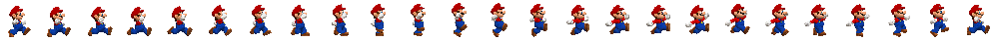
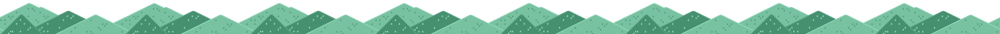

# Mario Bross Animation
###### Déplacement de Mario Bross de gauche a droite en utilisant un sprite 


et l'animation CSS

1.HTML

quatre  Div ont été crées
```html
    <div id="paysage"></div>
    <div id="sol-haut"></div>
    <div id="sol-bas"></div>
    <div id="mario" class="mario-droite" ></div>
````
2.CSS
dans le css les différent id ont été adapté  pour crée un fond d'écran continu en bas de la page avec une image de paysage répétée horizontalement.

```css
#paysage{
    /* Fond d'écran répété horizontalement avec une image "paysage.png" */
    background: url("../images/paysage.png") repeat-x;
    /* Position fixe par rapport à la fenêtre du navigateur */
    position: fixed;
    /* Position en bas de 71 pixels depuis le bord supérieur de la fenêtre */
    bottom: 71Px;
    /* Hauteur de l'élément de 283 pixels */
    height: 283px;
    /* Largeur de l'élément de 100% de la largeur de la fenêtre */
    width: 100%;
  
}
```


3.JAVASCRIPT
Des variables ont été définis
```javascript
let mario = document.querySelector("#mario");
let solHaut = document.querySelector("#sol-haut");
let solBas = document.querySelector("#sol-bas");
let paysage = document.querySelector("#paysage");
let ciel = document.querySelector("body");
````
Ce code est une fonction appelée "marcher" qui réagit aux événements clavier. Si la touche "ArrowLeft" est pressée, le personnage "Mario" marche vers la gauche en ajoutant une classe CSS et en animant les éléments visuels. Si la touche "ArrowRight" est pressée, le personnage "Mario" marche vers la droite de la même manière. La fonction gère la logique de déplacement du personnage et l'animation des éléments visuels du jeu.
```javascript
function marcher(event)
{
    switch (event.key) {
        case "ArrowLeft":
            // on fait marcher mario
            mario.classList.add("mario-gauche");
            mario.classList.remove("mario-droite");
            //on anime les différents éléments
            parallaxe();
            decalage++
            break;
        case "ArrowRight":
                 // on fait marcher mario
                mario.classList.add("mario-droite");
                mario.classList.remove("mario-gauche");
            parallaxe()
            decalage--;
             break;
        default:
            break;
    }    
}
```


 
   

